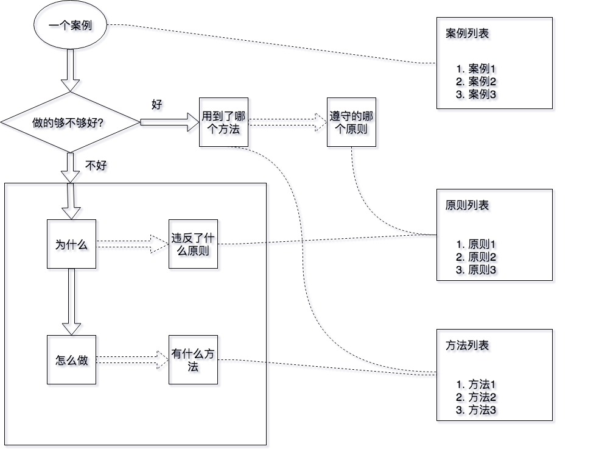

我介绍一下我总结的一个知识积累框架。

三个列表，一个方法
需要维护三个列表，分别是案例列表、原则列表和方法列表。
一个方法是如何运用这三个列表，达到反思并不断积累的效果。

三个列表分别需要维护，包括不断扩充和反复提炼。

大致流程是
1. 当有一个新的案例时，分析该案例
2. 这个案例的结果好不好？你是否满意？
3. 如果满意，分析好在哪里，依据是什么（原则），用到了哪个方法？
4. 如果不满意，分析为什么，违反了什么原则，有没有方法可以帮助改进？
5. 通过3和4扩充或者强化原则和方法

如图

